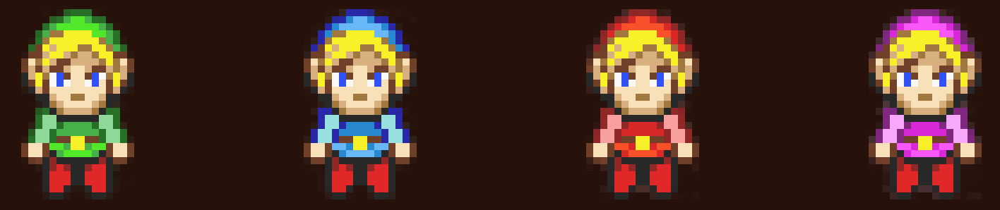
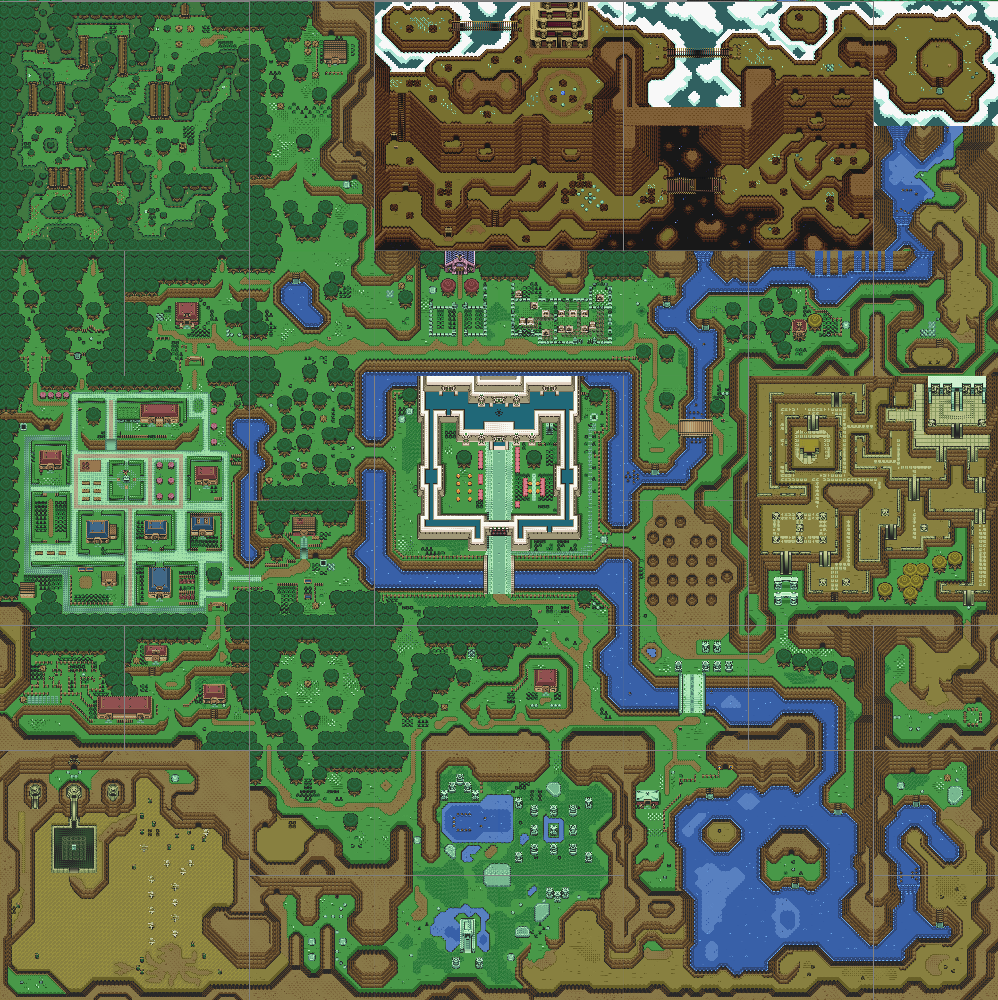
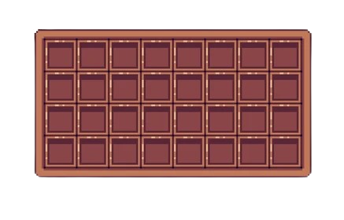
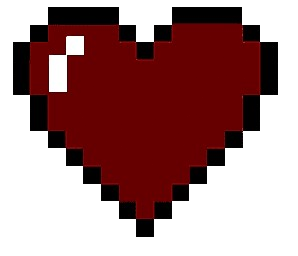
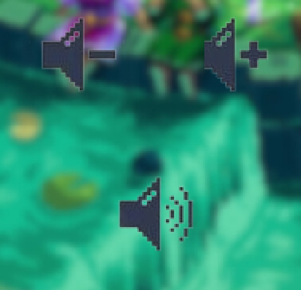

# My_RPG project

## Done by Théo LEYS-SION, Jade MUSSEAU, Régis CARRERE and Tom MAROT

### Overview

This project is a final project from the first year of EPITECH :desktop_computer: 
It's goal is to make a functional rpg game in CSFML in 6 weeks. 

### Features

* You can choose between 4 different Lonk,

* You have a quest that requires you to travel across all the map,

* To start this quest, talk to the mysterious old man in front of your house,
your destiny as a hero of legend is calling you, so answer it,

* You'll find your equipment and quest items in your inventory. To open it, press "i",

* Your life is represented by these hearts,
you can see them in the top left-hand corner of your in-game screen,
and you can get more as you play,

* When you take damage, you lose a heart, which is represented by the heart below,

* When you lose all your hearts, it's game over,

* Yon can get some help for playing by clicking on the navi icon
in the corner inside the option menu in game or on the main menu,

* You can go in an option menu to set the music,

* You can save your game and play with it after,

* You can resume your previous game with this button,

### Running this project locally

* Clone this repository locally,
* Run `make` in your terminal,
* Run `./my_rpg` in your terminal,

Then enjoy our rpg game. 

The list of the tools we used to do this project :hammer_and_wrench: 

